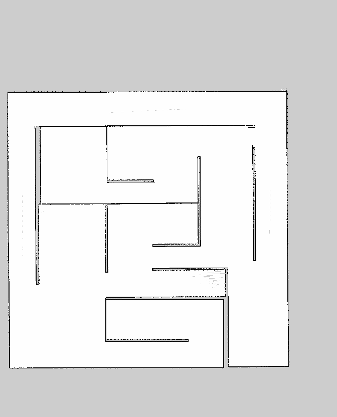

# SuperMegaBot_SMB
Project based on ETHZ 4 wheel Super Mega Bot (SMB) applications [[link]](https://ethz-robotx.github.io/SuperMegaBot/)

## Intro 

Autonomous Mobile Robot (AMR) Project for CCO - 728 - Autonomous Mobile Robot (Robôs Móveis Autônomos) course of PPGCC UFSCAr [[link]](https://www.ppgcc.ufscar.br/pt-br/programa/estrutura-curricular/disciplinas-do-programa/cco-728-robos-moveis-autonomos)

## Dependences

This package was implemented on Linux Ubuntu 20.04 Focal Fossa [[link]](https://releases.ubuntu.com/focal/) distribution using ROS1 Noetic Ninjemys [[link]](http://wiki.ros.org/noetic). The installation of the necessary ROS Noectic packages can be done with following bash command:

```bash
sudo apt-get install ros-noetic-amcl ros-noetic-costmap-converter ros-noetic-depthimage-to-laserscan ros-noetic-dynamic-reconfigure ros-noetic-ddynamic-reconfigure ros-noetic-ddynamic-reconfigure-dbgsym ros-noetic-ddynamic-reconfigure-python ros-noetic-geometry2 ros-noetic-hector-slam ros-noetic-move-base ros-noetic-move-base-flex ros-noetic-navigation ros-noetic-openslam-gmapping ros-noetic-rplidar-ros ros-noetic-slam-gmapping ros-noetic-spatio-temporal-voxel-layer ros-noetic-teb-local-planner ros-noetic-teleop-twist-keyboard ros-noetic-teleop-twist-joy ros-noetic-urg-node ros-noetic-rtabmap ros-noetic-rtabmap-ros ros-noetic-octomap ros-noetic-octomap-ros ros-noetic-octomap-rviz-plugins ros-noetic-octomap-server ros-noetic-octovis ros-noetic-imu-filter-madgwick ros-noetic-robot-localization ros-noetic-robot-pose-ekf ros-noetic-pointcloud-to-laserscan ros-noetic-rosbridge-server ros-noetic-map-server ros-noetic-realsense2-camera ros-noetic-realsense2-description ros-noetic-cmake-modules ros-noetic-velodyne-gazebo-plugins ros-noetic-ompl ros-noetic-navfn ros-noetic-dwa-local-planner ros-noetic-global-planner ros-noetic-costmap-2d ros-noetic-robot-self-filter ros-noetic-ros-numpy ros-noetic-pcl-ros ros-noetic-pcl-conversions ros-noetic-grid-map-costmap-2d ros-noetic-grid-map-ros ros-noetic-grid-map-filters ros-noetic-grid-map-visualization ros-noetic-tf2-tools pcl-tools python3-vcstool python3-catkin-tools python3-catkin-lint python3-pip python3-rosdep ros-noetic-gazebo-plugins ros-noetic-hector-gazebo ros-noetic-hector-gazebo-plugins
```
After that, it is necessary to clone the project inside a catkin workspace. If there isn't a catkin workspace, you can create by this tutorial [[link]](http://wiki.ros.org/catkin/Tutorials/create_a_workspace), or you can create using the following bash steps:

```bash
# source ROS1 Noetic
source /opt/ros/noetic/setup.bash
# create the directories
mkdir -p /home/$USER/catkin_workspace/src
cd /home/$USER/catkin_workspace/
# initilize the catkin workspace
catkin init
catkin config --extend /opt/ros/noetic
catkin config -DCMAKE_BUILD_TYPE=Release
# navigate to the directory of src to clone SuperMegaBot_SMB project
cd /home/$USER/catkin_workspace/src
git clone https://github.com/rrdpereira/SuperMegaBot_SMB.git
# build the project
cd /home/$USER/catkin_workspace/
catkin build
# source your catkin worksapce
source /home/$USER/catkin_workspace/devel/setup.bash

# (optinal) may you found some errors, so you can use the "Magic" of rosdep
cd /home/$USER/catkin_workspace/src
rosdep install --from-paths . --ignore-src --os=ubuntu:focal -r -y
cd /home/$USER/catkin_workspace/
catkin build
# source your catkin worksapce
source /home/$USER/catkin_workspace/devel/setup.bash
```

## Run Teleoperation Mode Without Map

To run the teleoperation mode of simulation without map:

```bash
roslaunch smb_gazebo smbTelNoMap.launch
```

### 📷 Screenshots and Demostration Video

You can watch the running teleoperation mode without map demonstration by the Youtube link [[link]](http://wiki.ros.org/catkin/Tutorials/create_a_workspace), and the preview by the following screenshots:

<p align="center">
  
  
  
  
  
  
  
  
</p>

## Run Teleoperation Mode With Map

To run the teleoperation mode of simulation with map:

```bash
roslaunch smb_gazebo smbTelMap.launch
```

### 📷 Screenshots and Demostration Video

You can watch the running teleoperation mode with map demonstration by the Youtube link [[link]](http://wiki.ros.org/catkin/Tutorials/create_a_workspace), and the preview by the following screenshots:

<p align="center">
  
  
  
  
  
  
  
  
  
</p>

## Run Mapping Mode

To run the mapping mode of simulation with Gmapping package:

```bash
roslaunch smb_gazebo smbMapG.launch
```
In another terminal launch the teleoperion:

```bash
roslaunch smb_gazebo smbTel.launch
```

In another terminal launch the map saver:

```bash
cd /home/$USER/catkin_workspace/src/SuperMegaBot_SMB/smb_gazebo/bash
watch -n 10 ./map_datehour.sh
```

### 📷 Screenshots and Demostration Video

You can watch the running mapping mode demonstration by the Youtube link [[link]](http://wiki.ros.org/catkin/Tutorials/create_a_workspace), and the preview by the following screenshots:

<p align="center">
  
  
  
  
  
  
  
  
  
  
</p>

## Run Autonomous Mode

To run the autonomous mode of simulation with Navigation Stack package:

```bash
roslaunch smb_gazebo smbAut.launch
```

### 📷 Screenshots and Demostration Video

You can watch the running autonomous mode demonstration by the Youtube link [[link]](http://wiki.ros.org/catkin/Tutorials/create_a_workspace), and the preview by the following screenshots:

<p align="center">
  
  
  
  
  
  
  
  
  
  
</p>

## References

 * https://ethz-robotx.github.io/SuperMegaBot/core-software/installation_core.html

 * https://ethz-robotx.github.io/SuperMegaBot/core-software/HowToRunSoftware.html

 * https://unlimited.ethz.ch/display/ROBOTX/SuperMegaBot

 * https://github.com/ethz-asl/eth_supermegabot

 * https://github.com/cra-ros-pkg/robot_localization/blob/noetic-devel/params/ekf_template.yaml